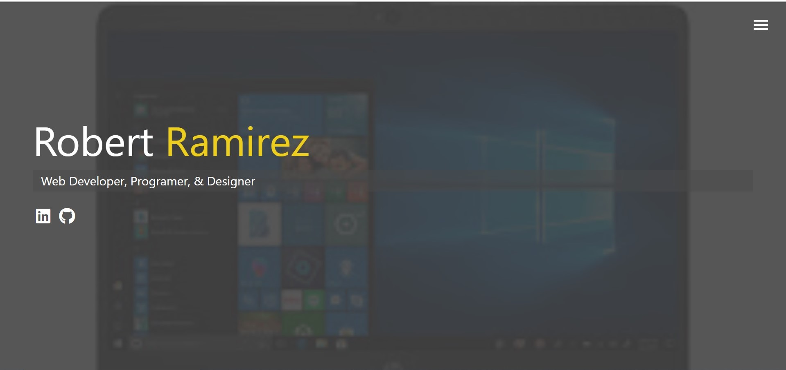
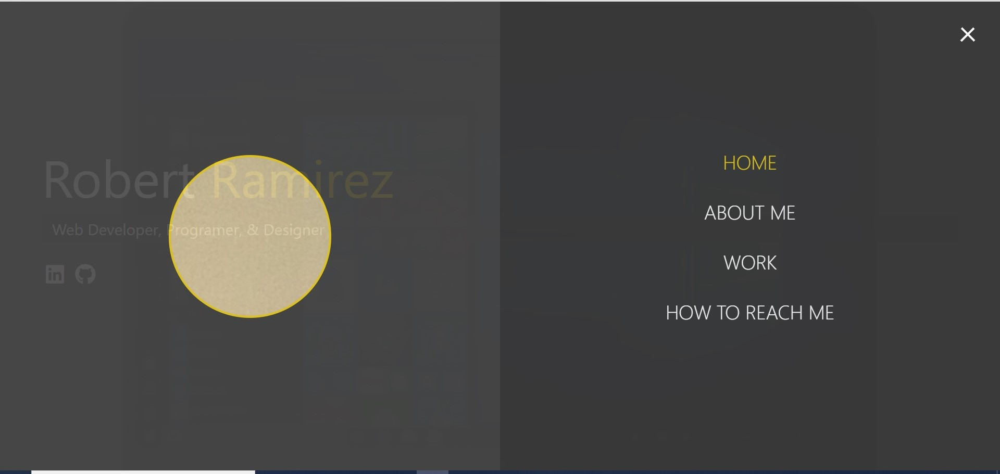
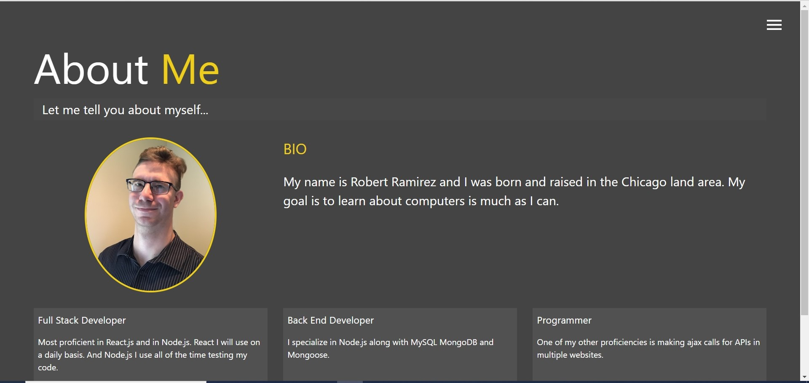

# modern_portfolio

responsive-portfolio

Welcome to my Portfolio this will have all of the information about me

# Features

This comes with basic Javascript along with using sass to add animation to my portfolio.

# How to use

The front page will show you my name and below it what and what my profession is. Below are the icons to my Github and my LinkIn profile

This is what the front page looks like.

On the top right is the menu button, use it to navigate to the different pages I have.

This is what happens when you click the Menu button

The list of buttons will take you to the respective pages in my portfolio.

The About Me page that I made.

